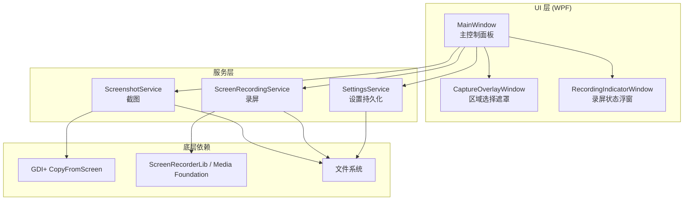
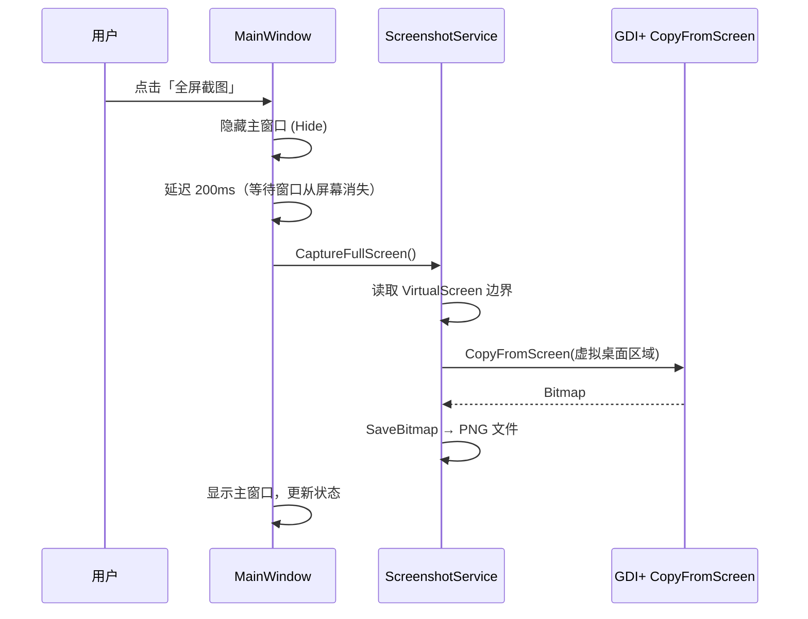
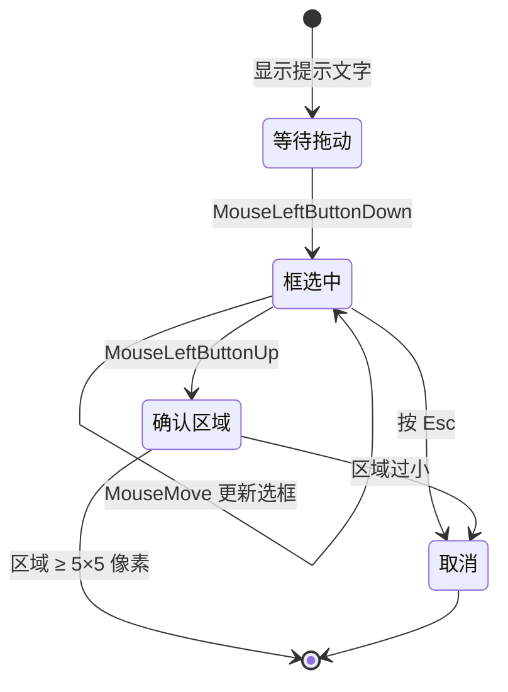
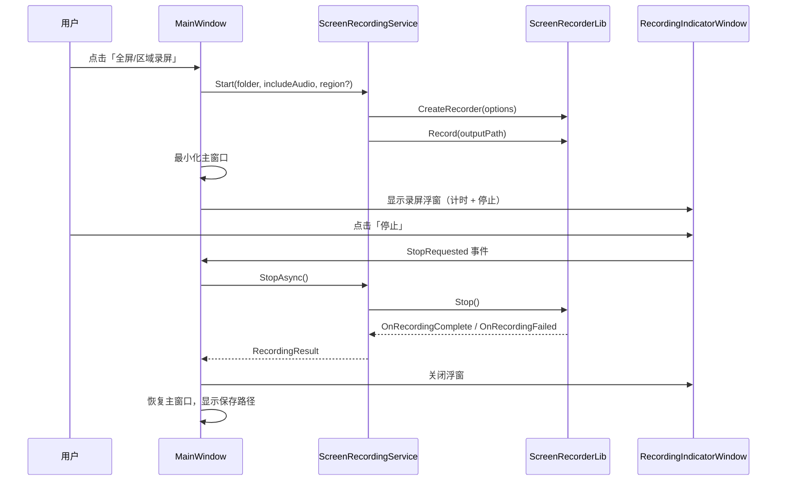

# 截图录屏工具 — 技术说明文档

## 1. 项目概述

本项目是一个基于 **WPF（.NET 8）** 的 Windows 桌面应用，提供以下能力：

| 功能 | 输出格式 | 说明 |
|------|----------|------|
| 全屏截图 | PNG | 截取所有显示器组成的虚拟桌面 |
| 区域截图 | PNG | 用户框选矩形区域后截取 |
| 全屏录屏 | MP4 (H.264) | 录制全部显示器画面，可选系统声音 |
| 区域录屏 | MP4 (H.264) | 框选区域后录制，可选系统声音 |

所有文件保存到用户指定的自定义文件夹，应用设置（保存路径、是否录制声音）持久化到本地 JSON 文件。

---

## 2. 技术栈

| 层次 | 技术 | 用途 |
|------|------|------|
| UI 框架 | WPF (.NET 8) | 主窗口、区域选择遮罩、录屏指示器 |
| 截图 | `System.Drawing.Common` | GDI+ 屏幕位图拷贝 |
| 录屏 | `ScreenRecorderLib 6.6.0` | Media Foundation 硬件编码为 H.264 MP4 |
| 配置 | `System.Text.Json` | 读写用户设置 |
| 平台 | **x64**（必须） | ScreenRecorderLib 依赖原生 x64 组件 |

---

## 3. 整体架构

应用采用简单的分层结构：**UI 层 → 服务层 → 系统 API / 第三方库**。



### 3.1 项目目录结构

```
Screenshot/
├── App.xaml / App.xaml.cs          # 应用入口
├── MainWindow.xaml / .cs           # 主界面与业务流程编排
├── Services/
│   ├── ScreenshotService.cs        # 截图逻辑
│   ├── ScreenRecordingService.cs   # 录屏逻辑
│   └── SettingsService.cs          # 设置读写
└── Windows/
    ├── CaptureOverlayWindow.xaml   # 全屏半透明选区窗口
    └── RecordingIndicatorWindow.xaml  # 录屏计时/停止浮窗
```

`MainWindow` 负责协调各模块，不包含底层捕获细节，便于维护与扩展。

---

## 4. 多显示器与坐标系

Windows 多显示器环境下，各屏幕按逻辑坐标排列，形成一个 **虚拟桌面（Virtual Screen）**。WPF 通过 `SystemParameters` 提供统一边界：

| 属性 | 含义 |
|------|------|
| `VirtualScreenLeft` / `VirtualScreenTop` | 虚拟桌面左上角坐标（可能为负值） |
| `VirtualScreenWidth` / `VirtualScreenHeight` | 虚拟桌面总宽高 |

截图与区域选择均基于此坐标系，保证主屏、副屏混排时坐标一致。

---

## 5. 截图实现原理

### 5.1 核心 API

截图使用 GDI+ 的 `Graphics.CopyFromScreen` 方法，从屏幕设备上下文（DC）直接拷贝像素到内存位图：

```csharp
var bitmap = new Bitmap(width, height, PixelFormat.Format32bppArgb);
using var graphics = Graphics.FromImage(bitmap);
graphics.CopyFromScreen(x, y, 0, 0, new Size(width, height), CopyPixelOperation.SourceCopy);
```

- `(x, y)`：屏幕上的起始坐标（虚拟桌面坐标系）
- `(width, height)`：截取区域大小
- 输出为 32 位 ARGB 位图，再保存为 PNG

### 5.2 全屏截图流程



**隐藏主窗口的原因：** 避免截图画面中出现工具自身 UI。

### 5.3 区域截图流程

1. 隐藏主窗口，弹出 `CaptureOverlayWindow` 全屏遮罩
2. 用户拖动鼠标框选矩形，松开后得到 `Int32Rect(x, y, width, height)`
3. 调用 `ScreenshotService.CaptureRegion(x, y, width, height)` 截取对应区域
4. 保存为 PNG

---

## 6. 区域选择遮罩（CaptureOverlayWindow）

区域截图与区域录屏共用同一个选区窗口。

### 6.1 窗口特性

| 属性 | 值 | 作用 |
|------|-----|------|
| `WindowStyle` | `None` | 无边框 |
| `AllowsTransparency` | `True` | 支持半透明背景 |
| `Topmost` | `True` | 始终在最上层 |
| 位置与大小 | `VirtualScreen*` | 覆盖全部显示器 |

### 6.2 交互逻辑



- 鼠标坐标相对于遮罩 Canvas，需加上 `VirtualScreenLeft/Top` 转换为屏幕绝对坐标
- 选区小于 5×5 像素视为无效操作并取消

---

## 7. 录屏实现原理

### 7.1 为什么使用 ScreenRecorderLib

录屏需要 **连续采集帧 + 实时视频编码 +（可选）音频混合**，若用截图方式逐帧 `CopyFromScreen` 再自行编码，CPU 占用高、帧率不稳定。

本项目采用 **ScreenRecorderLib**，其底层使用 Windows **Media Foundation** 进行 H.264 硬件编码，性能与兼容性较好。

> **注意：** 该库仅支持 x64/x86/ARM64 平台，不支持 Any CPU；需安装 [Visual C++ Redistributable x64](https://aka.ms/vs/17/release/vc_redist.x64.exe)。

### 7.2 录制源配置

```csharp
var sources = Recorder.GetDisplays().Cast<RecordingSourceBase>().ToList();
```

- 枚举系统中所有显示器作为录制源
- 若无可用显示器，回退到 `DisplayRecordingSource.MainMonitor`

### 7.3 全屏录屏

- `OutputFrameSize` 设为虚拟桌面宽高（经 `MakeEven` 调整为偶数，满足视频编码要求）
- 不设置 `SourceRect`，输出完整合成画面

### 7.4 区域录屏

通过 `OutputOptions.SourceRect` 裁剪输出：

```csharp
outputOptions.SourceRect = new ScreenRect(x, y, x + width, y + height);
outputOptions.OutputFrameSize = new ScreenSize(width, height);
```

- `ScreenRect` 参数为 `(left, top, right, bottom)` 屏幕绝对坐标
- 宽高必须为偶数（H.264 编码器常见要求），由 `MakeEven()` 处理

### 7.5 编码与音频参数

| 配置项 | 值 | 说明 |
|--------|-----|------|
| 视频编码 | H.264 Main Profile, CBR | 兼容性最好的格式 |
| 码率 | 6 Mbps | 平衡画质与文件大小 |
| 帧率 | 30 fps 固定 | `IsFixedFramerate = true` |
| 硬件编码 | 开启 | 降低 CPU 占用 |
| 音频 | 可选系统回放设备 | `IsOutputDeviceEnabled`，不录制麦克风 |
| 鼠标 | 显示指针 | `IsMousePointerEnabled = true` |

### 7.6 录屏生命周期



`ScreenRecordingService` 使用 `TaskCompletionSource<RecordingResult>` 将 ScreenRecorderLib 的回调事件转换为 `await` 友好的异步接口：

- `Start()` → 同步启动录制，返回预期文件路径
- `StopAsync()` → 调用 `_recorder.Stop()`，等待 `OnRecordingComplete` 或 `OnRecordingFailed` 回调

---

## 8. 录屏状态浮窗（RecordingIndicatorWindow）

录屏期间主窗口最小化，右下角显示半透明浮窗：

- 红色圆点 + 「正在录屏」文字
- `DispatcherTimer` 每秒更新录制时长
- 「停止」按钮触发 `StopRequested` 事件，由 `MainWindow` 统一调用 `StopRecordingAsync()`

主窗口也提供「停止录屏」按钮，两处入口共用同一停止逻辑。

---

## 9. 设置持久化

### 9.1 存储位置

```
%AppData%\ScreenshotTool\settings.json
```

### 9.2 配置项

```json
{
  "SaveFolder": "C:\\Users\\...\\Pictures\\Screenshots",
  "RecordSystemAudio": true
}
```

| 字段 | 类型 | 默认值 | 说明 |
|------|------|--------|------|
| `SaveFolder` | string | `我的图片\Screenshots` | 截图/录屏统一保存目录 |
| `RecordSystemAudio` | bool | `true` | 录屏是否包含系统声音 |

### 9.3 初始化防错

WPF 控件在 `InitializeComponent()` 期间可能触发数据绑定事件。为避免 `NullReferenceException`：

1. 在 `InitializeComponent()` **之前** 加载 `_settings`
2. 事件处理函数中通过 `if (!IsLoaded) return;` 跳过初始化阶段的误触发
3. CheckBox 默认值由代码赋值，不在 XAML 中写 `IsChecked="True"`

---

## 10. 文件命名规则

| 类型 | 命名格式 | 示例 |
|------|----------|------|
| 截图 | `Screenshot_yyyyMMdd_HHmmss_fff.png` | `Screenshot_20260609_143025_123.png` |
| 录屏 | `Recording_yyyyMMdd_HHmmss.mp4` | `Recording_20260609_143025.mp4` |

保存前自动 `Directory.CreateDirectory` 确保目标文件夹存在。

---

## 11. 异常与边界处理

| 场景 | 处理方式 |
|------|----------|
| 保存路径为空 | 弹窗提示，阻止操作 |
| 保存路径不可写 | 弹窗显示具体错误 |
| 区域选择过小（< 5px） | 视为取消 |
| 录屏中关闭主窗口 | 弹窗确认，确认后停止录屏再退出 |
| 录屏中重复启动 | `ScreenRecordingService` 抛出异常 |
| 设置文件损坏/缺失 | 回退到默认配置 |

---

## 12. 构建与运行要求

### 12.1 编译

- 目标框架：`net8.0-windows`
- 平台：**x64**（解决方案与项目均已配置，不可使用 Any CPU）
- Visual Studio 顶部平台选择器需为 **x64**

```powershell
dotnet build Screenshot.sln
dotnet run --project Screenshot\Screenshot.csproj
```

### 12.2 运行时依赖

- Windows 8 及以上
- .NET 8 Desktop Runtime
- Visual C++ Redistributable x64（ScreenRecorderLib 需要）
- Media Foundation（Windows 10/11 默认已包含；Server 或 N/KN 版需额外安装 Media Feature Pack）

---

## 13. 扩展建议

以下为常见扩展方向，当前版本尚未实现：

| 方向 | 实现思路 |
|------|----------|
| 全局快捷键 | 注册 Win32 热键或 `RegisterHotKey`，后台监听 |
| 系统托盘 | `NotifyIcon` + 最小化到托盘，隐藏主窗口 |
| 麦克风录制 | `AudioOptions.IsInputDeviceEnabled = true`，选择输入设备 |
| 窗口录屏 | `WindowRecordingSource(hwnd)` 替代显示器源 |
| 截图复制到剪贴板 | `Clipboard.SetImage()` 配合 WPF `BitmapSource` 转换 |
| 延迟截图/录屏 | `Task.Delay` + 倒计时 Overlay |

---

## 14. 总结

本工具将 **截图** 与 **录屏** 两类能力统一在同一 WPF 应用中：

- **截图**走 GDI+ 一次性位图拷贝，实现简单、延迟低，适合静态画面
- **录屏**走 Media Foundation 硬件编码，适合长时间、高帧率视频采集
- **区域选择**通过全屏 WPF 透明遮罩实现，截图与录屏复用同一交互
- **MainWindow** 作为流程编排中心，底层细节封装在 Service 层，结构清晰、易于维护
