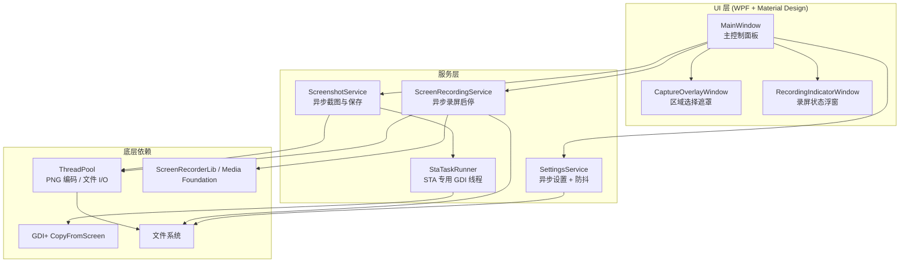
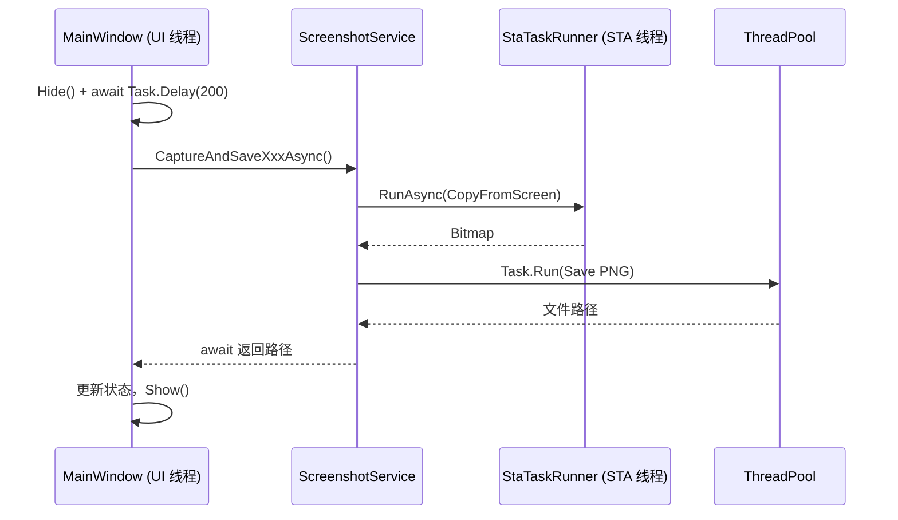
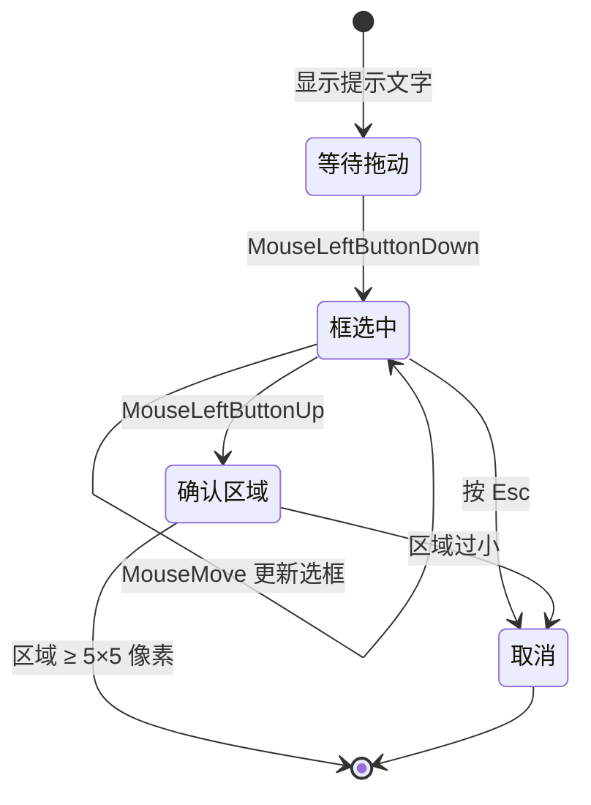
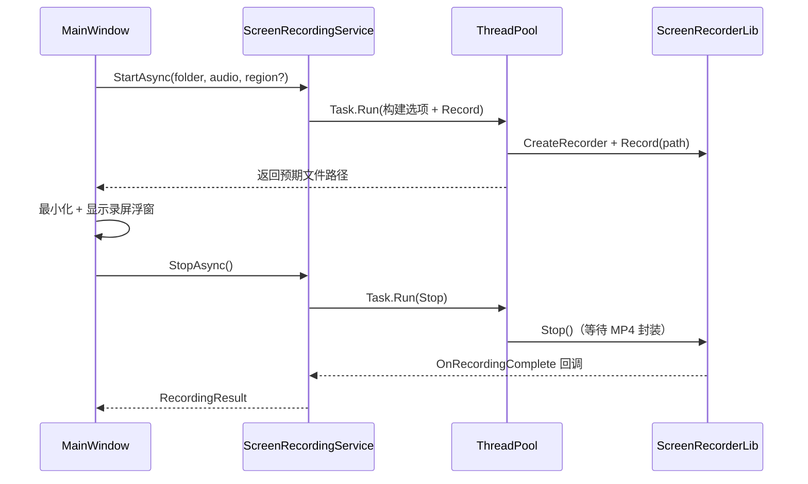

# 截图录屏工具 — 技术说明文档

## 1. 项目概述

本项目是一个基于 **WPF（.NET 8）** 的 Windows 桌面应用，集成截图与录屏能力，采用 **Material Design 3** 风格界面，并通过异步/多线程优化保证 UI 流畅。

| 功能 | 输出格式 | 说明 |
|------|----------|------|
| 全屏截图 | PNG | 截取所有显示器组成的虚拟桌面 |
| 区域截图 | PNG | 用户框选矩形区域后截取 |
| 全屏录屏 | MP4 (H.264) | 录制全部显示器画面，可选系统声音 |
| 区域录屏 | MP4 (H.264) | 框选区域后录制，可选系统声音 |

所有文件保存到用户指定的自定义文件夹。应用设置（保存路径、是否录制声音）持久化到本地 JSON 文件。

---

## 2. 技术栈

| 层次 | 技术 | 版本 | 用途 |
|------|------|------|------|
| UI 框架 | WPF (.NET 8) | — | 主窗口、区域选择遮罩、录屏指示器 |
| UI 样式库 | MaterialDesignInXamlToolkit | 5.3.2 | Material Design 3 主题、Card、按钮、图标 |
| 截图 | System.Drawing.Common | 8.0.11 | GDI+ 屏幕位图拷贝 |
| 录屏 | ScreenRecorderLib | 6.6.0 | Media Foundation 硬件编码为 H.264 MP4 |
| 配置 | System.Text.Json | 内置 | 异步读写用户设置 |
| 并发 | Task / STA 线程 / SemaphoreSlim | 内置 | 截图、保存、录屏启停异步化 |
| 平台 | **x64**（必须） | — | ScreenRecorderLib 依赖原生 x64 组件 |

### 2.1 NuGet 依赖

```xml
<PackageReference Include="MaterialDesignThemes" Version="5.3.2" />
<PackageReference Include="ScreenRecorderLib" Version="6.6.0" />
<PackageReference Include="System.Drawing.Common" Version="8.0.11" />
```

---

## 3. 整体架构

应用采用 **UI 层 → 服务层 → 系统 API / 第三方库** 的分层结构，`MainWindow` 负责流程编排，底层细节封装在 Service 层。



### 3.1 项目目录结构

```
Screenshot/
├── App.xaml / App.xaml.cs              # 应用入口，Material Design 主题
├── MainWindow.xaml / .cs               # 主界面与异步业务流程编排
├── Services/
│   ├── ScreenshotService.cs            # 异步截图与 PNG 保存
│   ├── StaTaskRunner.cs                # GDI 专用 STA 工作线程
│   ├── ScreenRecordingService.cs     # 异步录屏启停
│   └── SettingsService.cs              # 异步设置读写与防抖保存
└── Windows/
    ├── CaptureOverlayWindow.xaml       # 全屏半透明选区窗口
    └── RecordingIndicatorWindow.xaml   # 录屏计时/停止浮窗
```

---

## 4. UI 设计与 Material Design

### 4.1 主题配置

在 `App.xaml` 中通过 `BundledTheme` 加载 Material Design 3 主题：

```xml
<materialDesign:BundledTheme BaseTheme="Light"
                             PrimaryColor="DeepPurple"
                             SecondaryColor="Teal" />
<ResourceDictionary Source="pack://application:,,,/MaterialDesignThemes.Wpf;component/Themes/MaterialDesign3.Defaults.xaml" />
```

- **主色 DeepPurple**：按钮、选区描边、状态图标
- **辅色 Teal**：成功状态提示
- **浅色主题**：适配桌面截图/录屏工具的使用场景

### 4.2 主界面布局（MainWindow）

| 区域 | 组件 | 说明 |
|------|------|------|
| 标题区 | `MaterialDesignHeadline5TextBlock` | 应用名称与简介 |
| 保存设置 Card | `MaterialDesignOutlinedTextBox` + 按钮 | 路径输入、**浏览**、**打开** 并排 |
| 操作 Card | `RaisedButton` / `OutlinedButton` | 截图与录屏分区，带 `PackIcon` 图标 |
| 状态区 | `Card` + `PackIcon` | 信息/成功/警告/错误四种状态 |

**布局要点：**

- 已移除「最近保存」区域，界面更简洁
- 「打开」按钮紧跟「浏览」按钮，用于快速打开保存目录
- 录屏停止按钮使用红色 `MaterialDesignValidationErrorBrush` 突出危险操作

### 4.3 辅助窗口

| 窗口 | 风格 |
|------|------|
| `CaptureOverlayWindow` | 半透明遮罩 + DeepPurple 选框 |
| `RecordingIndicatorWindow` | Material Card 浮窗，右下角显示计时与停止按钮 |

---

## 5. 多显示器与坐标系

Windows 多显示器环境下，各屏幕按逻辑坐标排列，形成 **虚拟桌面（Virtual Screen）**。WPF 通过 `SystemParameters` 提供统一边界：

| 属性 | 含义 |
|------|------|
| `VirtualScreenLeft` / `VirtualScreenTop` | 虚拟桌面左上角坐标（可能为负值） |
| `VirtualScreenWidth` / `VirtualScreenHeight` | 虚拟桌面总宽高 |

截图、区域选择与录屏裁剪均基于此坐标系。虚拟桌面尺寸在 UI 线程读取后传入服务层，避免跨线程访问 `SystemParameters`。

---

## 6. 截图实现原理

### 6.1 核心 API

截图使用 GDI+ 的 `Graphics.CopyFromScreen`，从屏幕设备上下文直接拷贝像素：

```csharp
var bitmap = new Bitmap(width, height, PixelFormat.Format32bppArgb);
using var graphics = Graphics.FromImage(bitmap);
graphics.CopyFromScreen(x, y, 0, 0, new Size(width, height), CopyPixelOperation.SourceCopy);
```

### 6.2 异步截图流水线

截图分为 **捕获** 与 **保存** 两阶段，分别在独立线程执行：



| 阶段 | 执行线程 | 原因 |
|------|----------|------|
| 屏幕捕获 | STA 专用线程 (`StaTaskRunner`) | GDI+ 在 STA 线程上最稳定 |
| PNG 编码与写盘 | 线程池 (`Task.Run`) | 大图编码耗时，不应阻塞 UI |
| UI 更新 | UI 线程 (`ConfigureAwait(true)`) | WPF 控件线程亲和性要求 |

**对外 API：**

```csharp
Task<string> CaptureAndSaveFullScreenAsync(string folder, CancellationToken ct);
Task<string> CaptureAndSaveRegionAsync(int x, int y, int w, int h, string folder, CancellationToken ct);
```

### 6.3 全屏 / 区域截图流程

1. 校验保存路径
2. `PrepareForCaptureAsync()`：隐藏主窗口，延迟 200ms（避免自身 UI 入镜）
3. 区域截图时弹出 `CaptureOverlayWindow` 获取选区
4. 调用 `ScreenshotService` 异步捕获并保存
5. 恢复主窗口，通过状态 Card 显示结果

---

## 7. STA 专用工作线程（StaTaskRunner）

GDI/GDI+ 操作对线程单元（Apartment）敏感。若在线程池（MTA）上调用 `CopyFromScreen`，可能偶发失败或不稳定。

`StaTaskRunner` 在应用启动时创建一个后台 **STA 线程**，通过 `BlockingCollection<Action>` 串行处理 GDI 任务：

```csharp
// 静态构造：启动名为 "ScreenshotStaWorker" 的 STA 后台线程
WorkerThread.SetApartmentState(ApartmentState.STA);

// 对外接口
public static Task<T> RunAsync<T>(Func<T> work, CancellationToken cancellationToken);
```

特点：

- **串行队列**：同一时刻只执行一个 GDI 任务，避免 GDI 句柄竞争
- **支持取消**：`CancellationToken` 注册到 `TaskCompletionSource`
- **延续异步**：`RunContinuationsAsynchronously` 避免回调阻塞 STA 线程

---

## 8. 区域选择遮罩（CaptureOverlayWindow）

区域截图与区域录屏共用同一选区窗口。

### 8.1 窗口特性

| 属性 | 值 | 作用 |
|------|-----|------|
| `WindowStyle` | `None` | 无边框 |
| `AllowsTransparency` | `True` | 半透明背景 |
| `Topmost` | `True` | 始终在最上层 |
| 位置与大小 | `VirtualScreen*` | 覆盖全部显示器 |

### 8.2 交互逻辑



- 鼠标坐标相对于遮罩 Canvas，加上 `VirtualScreenLeft/Top` 转为屏幕绝对坐标
- 选区小于 5×5 像素视为无效并取消
- 支持自定义提示文字（截图 / 录屏场景复用）

---

## 9. 录屏实现原理

### 9.1 为什么使用 ScreenRecorderLib

录屏需要 **连续采集帧 + 实时视频编码 +（可选）音频混合**。若用截图方式逐帧 `CopyFromScreen` 再自行编码，CPU 占用高、帧率不稳定。

本项目采用 **ScreenRecorderLib**，底层使用 Windows **Media Foundation** 进行 H.264 硬件编码。录屏采集与编码在原生层多线程运行，应用层主要负责启停控制。

> **注意：** 该库仅支持 x64/x86/ARM64，不支持 Any CPU；需安装 [Visual C++ Redistributable x64](https://aka.ms/vs/17/release/vc_redist.x64.exe)。

### 9.2 录制源与裁剪

```csharp
var sources = Recorder.GetDisplays().Cast<RecordingSourceBase>().ToList();
// 区域录屏时：
outputOptions.SourceRect = new ScreenRect(x, y, x + width, y + height);
outputOptions.OutputFrameSize = new ScreenSize(width, height);
```

- 枚举所有显示器作为录制源，无可用显示器时回退到主显示器
- `ScreenRect` 为 `(left, top, right, bottom)` 屏幕绝对坐标
- 宽高经 `MakeEven()` 调整为偶数，满足 H.264 编码器要求

### 9.3 编码与音频参数

| 配置项 | 值 | 说明 |
|--------|-----|------|
| 视频编码 | H.264 Main Profile, CBR | 兼容性最好 |
| 码率 | 6 Mbps | 平衡画质与文件大小 |
| 帧率 | 30 fps 固定 | `IsFixedFramerate = true` |
| 硬件编码 | 开启 | 降低 CPU 占用 |
| 音频 | 可选系统回放设备 | 不录制麦克风 |
| 鼠标 | 显示指针 | `IsMousePointerEnabled = true` |

### 9.4 异步录屏启停



| 方法 | 说明 |
|------|------|
| `StartAsync()` | 在线程池中完成目录创建、选项构建、`Record()` 调用 |
| `StopAsync()` | 在线程池中调用 `Stop()`，通过 `TaskCompletionSource` 等待完成/失败回调 |
| `SemaphoreSlim` | 保证启停操作互斥，防止并发调用 |

`TaskCompletionSource<RecordingResult>` 将 ScreenRecorderLib 的事件回调转为 `await` 友好接口，延续以异步方式执行（`RunContinuationsAsynchronously`）。

---

## 10. 异步与并发设计

### 10.1 设计目标

| 目标 | 手段 |
|------|------|
| UI 不卡顿 | 截图/保存/录屏停止均在后台线程执行 |
| GDI 稳定 | 专用 STA 线程处理 `CopyFromScreen` |
| 设置写入高效 | 路径输入防抖 400ms，避免每次按键写盘 |
| 可取消 | `CancellationToken` 贯穿截图与窗口生命周期 |

### 10.2 MainWindow 异步流程

```csharp
// 窗口级取消源：关闭窗口时取消所有进行中的操作
private readonly CancellationTokenSource _windowCts = new();

// 操作级取消源：新操作开始时取消上一个
private CancellationTokenSource? _operationCts;

// 启动时异步加载设置（Loaded 事件）
_settings = await SettingsService.LoadAsync(_windowCts.Token);

// 截图全程 async/await，ConfigureAwait(true) 回到 UI 线程更新界面
var savedPath = await ScreenshotService.CaptureAndSaveFullScreenAsync(folder, ct);
```

### 10.3 设置服务异步与防抖

```csharp
// 异步读取（启动时）
Task<AppSettings> LoadAsync(CancellationToken ct);

// 异步写入（复选框切换等即时保存）
Task SaveAsync(AppSettings settings, CancellationToken ct);

// 防抖写入（路径文本框输入，默认延迟 400ms）
void ScheduleSave(AppSettings settings, int delayMilliseconds = 400);
```

| 机制 | 作用 |
|------|------|
| `FileStream` + `useAsync: true` | 非阻塞文件读写 |
| `SemaphoreSlim` | 防止并发写入 settings.json |
| `CancellationTokenSource` 防抖 | 快速输入时只触发最后一次保存 |

### 10.4 初始化防错

| 问题 | 解决方案 |
|------|----------|
| 控件事件在 `InitializeComponent` 期间触发 | 设置加载改到 `Loaded` 异步事件 |
| 应用设置时触发 TextChanged | `_isApplyingSettings` 标志位跳过 |
| 路径输入频繁写盘 | `ScheduleSave` 防抖 |

---

## 11. 设置持久化

### 11.1 存储位置

```
%AppData%\ScreenshotTool\settings.json
```

### 11.2 配置项

```json
{
  "SaveFolder": "C:\\Users\\...\\Pictures\\Screenshots",
  "RecordSystemAudio": true
}
```

| 字段 | 类型 | 默认值 | 说明 |
|------|------|--------|------|
| `SaveFolder` | string | `我的图片\Screenshots` | 截图/录屏统一保存目录 |
| `RecordSystemAudio` | bool | `true` | 录屏是否包含系统声音 |

---

## 12. 文件命名规则

| 类型 | 命名格式 | 示例 |
|------|----------|------|
| 截图 | `Screenshot_yyyyMMdd_HHmmss_fff.png` | `Screenshot_20260609_143025_123.png` |
| 录屏 | `Recording_yyyyMMdd_HHmmss.mp4` | `Recording_20260609_143025.mp4` |

保存前自动 `Directory.CreateDirectory` 确保目标文件夹存在。

---

## 13. 异常与边界处理

| 场景 | 处理方式 |
|------|----------|
| 保存路径为空 | 弹窗提示，阻止操作 |
| 保存路径不可写 | 弹窗显示具体错误 |
| 区域选择过小（< 5px） | 视为取消 |
| 录屏中关闭主窗口 | 弹窗确认，确认后异步停止录屏再退出 |
| 录屏中重复启动 | `ScreenRecordingService` 抛出异常 |
| 设置文件损坏/缺失 | 回退到默认配置 |
| 窗口关闭时操作进行中 | `CancellationToken` 取消，捕获 `OperationCanceledException` |
| 打开文件夹 | `Task.Run` 异步启动资源管理器，不阻塞 UI |

---

## 14. 构建与运行要求

### 14.1 编译

- 目标框架：`net8.0-windows`
- 平台：**x64**（解决方案与项目均已配置，不可使用 Any CPU）
- Visual Studio 顶部平台选择器需为 **x64**

```powershell
dotnet build Screenshot.sln
dotnet run --project Screenshot\Screenshot.csproj
```

### 14.2 运行时依赖

- Windows 8 及以上
- .NET 8 Desktop Runtime
- Visual C++ Redistributable x64（ScreenRecorderLib 需要）
- Media Foundation（Windows 10/11 默认已包含；Server 或 N/KN 版需额外安装 Media Feature Pack）

---

## 15. 性能优化总结

| 操作 | 优化前 | 优化后 |
|------|--------|--------|
| 全屏截图 | UI 线程同步捕获 + 保存 | STA 线程捕获 + 线程池保存 |
| 大图 PNG 保存 | 阻塞 UI | `Task.Run` 后台编码写入 |
| 路径输入保存 | 每次按键同步写盘 | 400ms 防抖异步写入 |
| 录屏启动 | UI 线程同步初始化 | `Task.Run` 后台构建选项并启动 |
| 录屏停止 | `Stop()` 可能卡住 UI | 后台等待 MP4 封装完成 |
| 打开文件夹 | 同步 `Process.Start` | `Task.Run` 异步启动 |

录屏过程中的帧采集与 H.264 硬件编码由 ScreenRecorderLib 在原生层处理，已是多线程流水线，应用层主要优化了 **截图路径** 与 **UI 交互路径**。

---

## 16. 扩展建议

| 方向 | 实现思路 |
|------|----------|
| 全局快捷键 | 注册 Win32 `RegisterHotKey`，后台监听 |
| 系统托盘 | `NotifyIcon` + 最小化到托盘 |
| 麦克风录制 | `AudioOptions.IsInputDeviceEnabled = true` |
| 窗口录屏 | `WindowRecordingSource(hwnd)` 替代显示器源 |
| 截图复制到剪贴板 | `Clipboard.SetImage()` + `BitmapSource` 转换 |
| 暗色主题 | `App.xaml` 中 `BaseTheme="Dark"` |
| Snackbar 通知 | MaterialDesign `SnackbarMessageQueue` 替代状态 Card |

---

## 17. 总结

本工具将 **截图**、**录屏** 与 **现代 Material UI** 统一在同一 WPF 应用中：

- **截图**：GDI+ 一次性位图拷贝，经 STA 线程 + 线程池两阶段异步处理
- **录屏**：Media Foundation 硬件编码，启停异步化避免 UI 阻塞
- **区域选择**：全屏 WPF 透明遮罩，截图与录屏复用
- **界面**：MaterialDesignInXamlToolkit 提供统一的 MD3 视觉风格
- **架构**：`MainWindow` 编排流程，Service 层封装底层细节，职责清晰、易于维护与扩展
